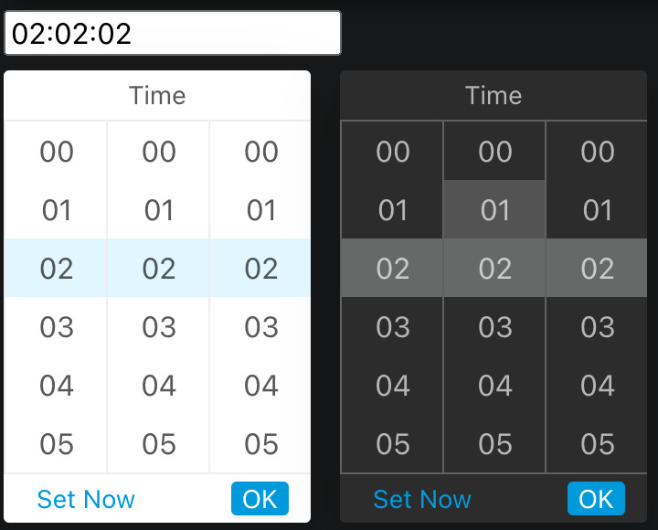
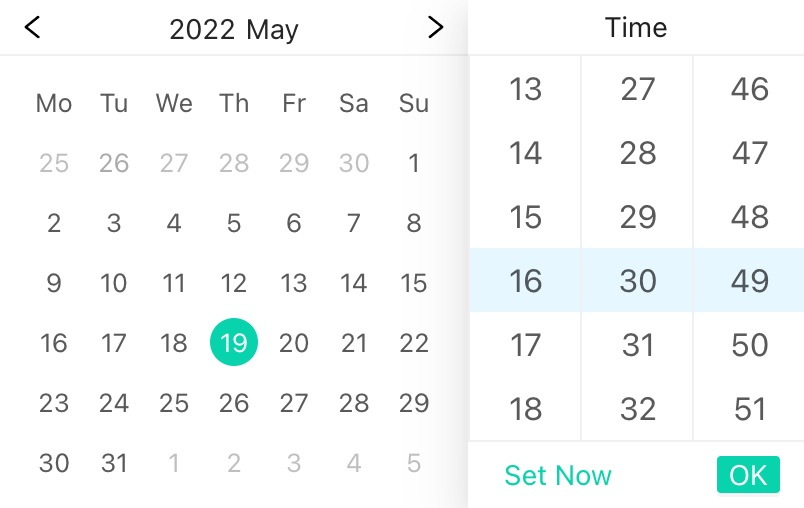

# bear-react-datepicker

> Datepicker library based for Reactjs





[](https://www.npmjs.com/package/bear-react-datepicker)
[](https://www.npmjs.com/package/bear-react-datepicker)


## Support Version Map

React | React Scripts | Bear React Grid | 
------|:--------------|----------------:|
18    | 5.0.1         |           2.0.0 |
17    | 4.0.3         |          1.0.12 |

## Install

```bash
yarn add bear-react-datepicker
```

## Usage

add in your index.tsx
```tst
import "bear-react-datepicker/dist/index.css";

```

then in your page
```tsx
import {Datepicker, Timepicker, DateTimepicker} from 'bear-react-datepicker';


const BaseUsed = () => {

    return (
        <div>
            <Datepicker value={myDate} onChange={setMyDate} isVisibleSetToday locale="zh-CN"/>

            <Timepicker value={myTime} onChange={setMyTime} onClickOk={() => {}}/>
            
            <DateTimepicker value={myDateTime} onChange={setMyDateTime}  />
        </div>
    );

};
```


There is also a codesandbox template that you can fork and play with it:

[](https://codesandbox.io/s/9he8m8)


## License

MIT © [imagine10255](https://github.com/imagine10255)
